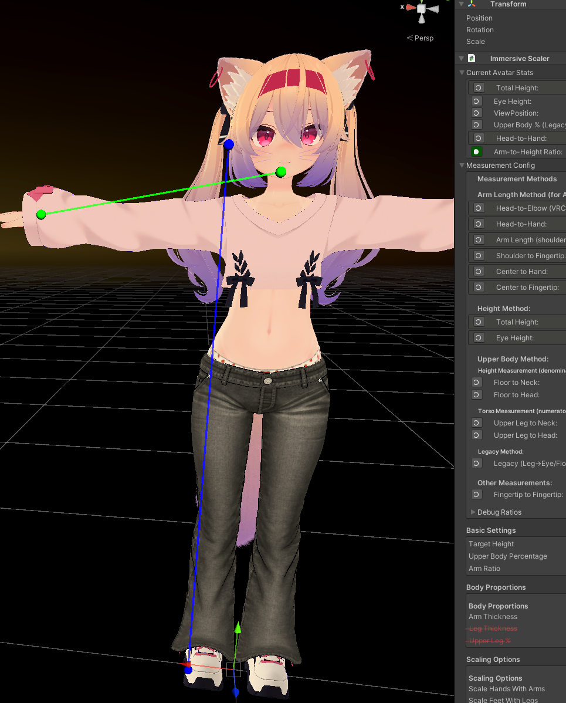
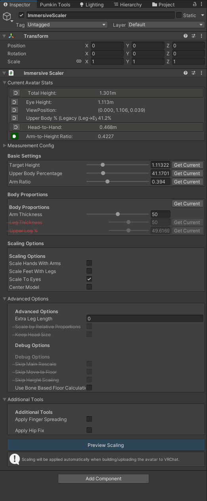
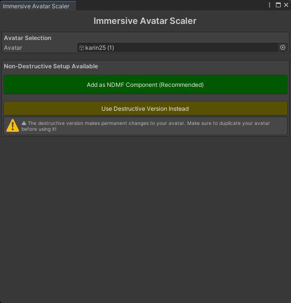
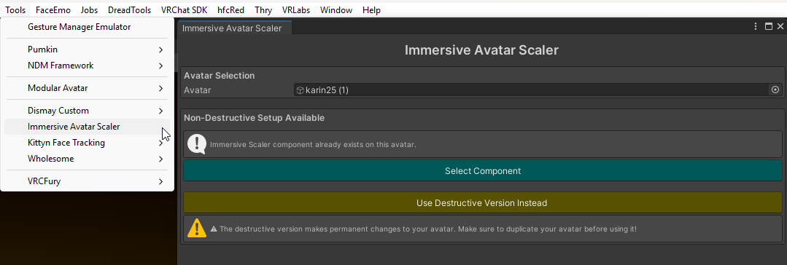

# VRChat Immersive Scaler

A Unity tool for properly scaling VRChat avatars to match real-world proportions while maintaining VR immersion. Features NDMF integration for non-destructive avatar modifications.

> **Note**: The exact IK measurement parameters VRChat uses internally are not fully documented. The current defaults are based on community research and testing. We'll update with firm defaults and bump the version once the exact parameters are confirmed.

[](https://vcc.docs.vrchat.com)
[](https://unity.com)
[](https://github.com/bdunderscore/ndmf)

## 🚀 Quick Install

Add to VCC with one click:

<a href="https://immersive-scaler.kittyn.cat/install">
  
</a>

Or manually add this URL to VCC:
```
https://immersive-scaler.kittyn.cat/index.json
```

## 📋 Features

### Core Scaling Features
- ✅ **Automated Avatar Scaling** - One-click scaling to match your real height
- ✅ **VRChat IK Compatibility** - Maintains proper VRChat IK measurements
- ✅ **Automatic ViewPosition** - Maintains correct eye position after scaling
- ✅ **Non-Destructive** - Unity version uses NDMF for build-time processing

### Customization Options
- 🎯 Upper body vs lower body ratio adjustment
- 🎯 Arm and leg thickness control
- 🎯 Thigh vs calf proportion tuning
- 🎯 Hand and foot scaling options
- 🎯 Custom VRChat arm ratio (IK arm length)

### Advanced Features
- 🔧 Multiple measurement methods (eye height, total height, various arm measurements)
- 🔧 Visual measurement gizmos for debugging
- 🔧 Finger spreading for better controller tracking
- 🔧 Hip bone adjustment tool
- 🔧 Center avatar at origin
- 🔧 Automatic floor placement



*Visual measurement gizmos help you understand the scaling calculations*

## 📋 Requirements

- Unity 2019.4 or newer (VRChat's supported version)
- VRChat SDK3 Avatars
- [NDMF (Non-Destructive Modular Framework)](https://github.com/bdunderscore/ndmf) - installed automatically if using VCC
- Avatar with Humanoid rig configuration

## 🛠️ Usage

### Basic Setup
1. Add the **Immersive Scaler** component to your avatar
2. Click "Get Current" to populate values from your avatar
3. Adjust settings as needed
4. Use "Preview Scaling" to see changes
5. Upload your avatar - scaling is applied automatically!



*The Immersive Scaler component interface*

### Two Ways to Use

#### Method 1: NDMF Component (Recommended)
- Add the Immersive Scaler component to your avatar
- Non-destructive - original avatar is preserved
- Scaling applied during upload/build

#### Method 2: Tools Menu
- Go to Tools → Immersive Avatar Scaler
- Make permanent changes to your avatar
- Useful for testing and debugging



*The Tools window showing NDMF component option*



*Alert shown when component already exists on avatar*

[📖 Full Documentation](VRChatImmersiveScaler/README.md)

## 🔧 Troubleshooting

### Common Issues

**Avatar shrinks unexpectedly**
- Click "Get Current" before making adjustments
- Ensure you're using the correct measurement methods

**Preview doesn't match final result**
- Make sure all bones are properly mapped
- Check that your avatar has a valid Humanoid configuration

**VCC can't find the package**
- Ensure you've added the repository URL correctly
- Try refreshing your package list in VCC

[📖 Full Troubleshooting Guide](VRChatImmersiveScaler/TROUBLESHOOTING.md)

## 🤝 Contributing

Contributions are welcome! Please read our contributing guidelines before submitting PRs.

1. Fork the repository
2. Create your feature branch (`git checkout -b feature/AmazingFeature`)
3. Commit your changes (`git commit -m 'Add some AmazingFeature'`)
4. Push to the branch (`git push origin feature/AmazingFeature`)
5. Open a Pull Request

## 📜 License

This project is licensed under the MIT License - see the LICENSE file for details.

## 🙏 Acknowledgments

- Inspired by the [Immersive Scaler Blender addon](https://github.com/Pager07/immersive_scaler) - mathematical concepts reimplemented for Unity
- NDMF framework by bd_ for non-destructive Unity modifications
- VRChat community for testing and feedback
- All contributors to the Immersive Scaler project

## 📞 Support

- **Issues**: [GitHub Issues](https://github.com/kittynXR/imscaler/issues)
- **Discord**: Coming soon
- **Documentation**: [Full Documentation](VRChatImmersiveScaler/README.md)

---

Made with ❤️ for the VRChat community